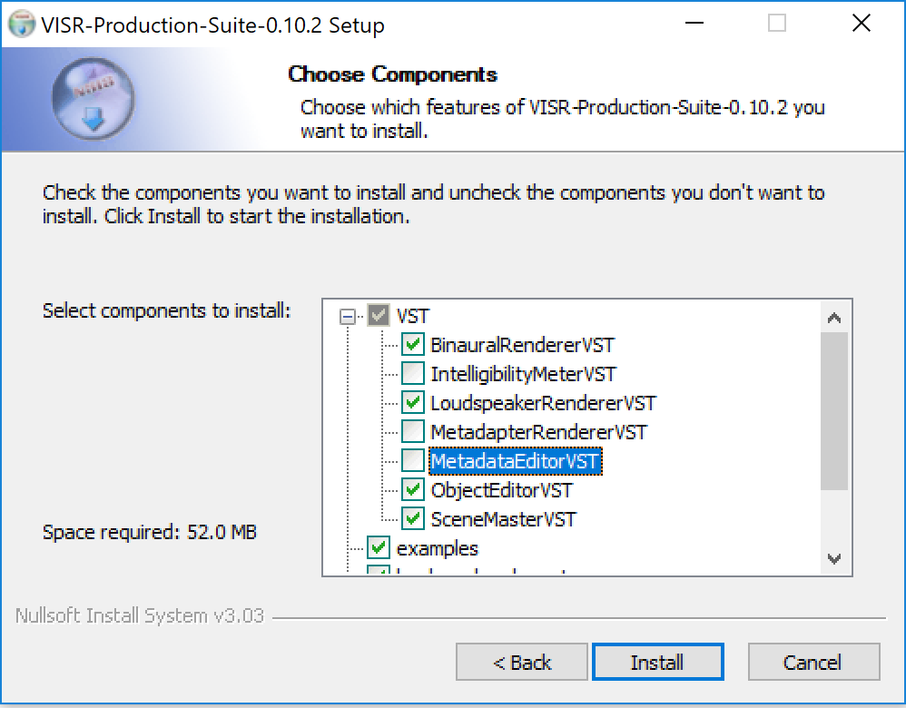
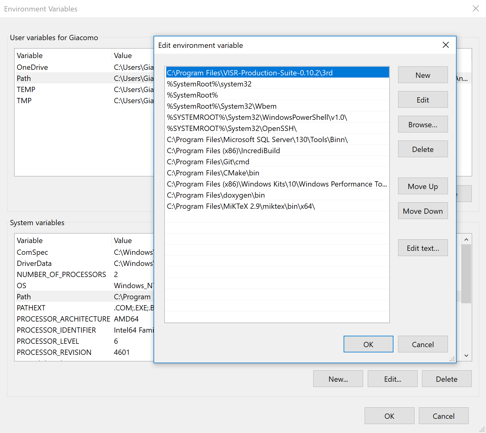
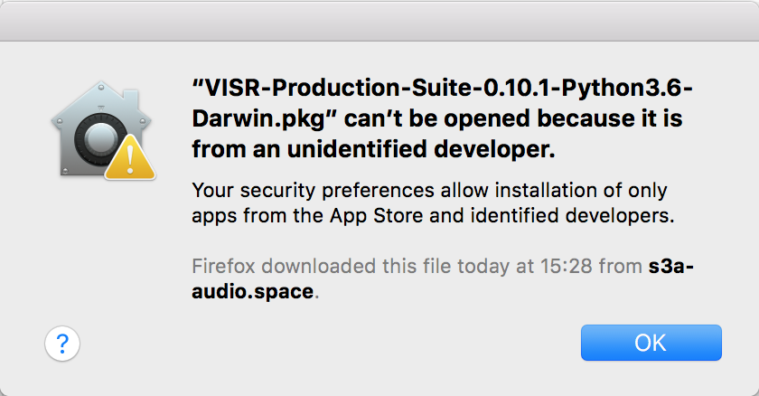
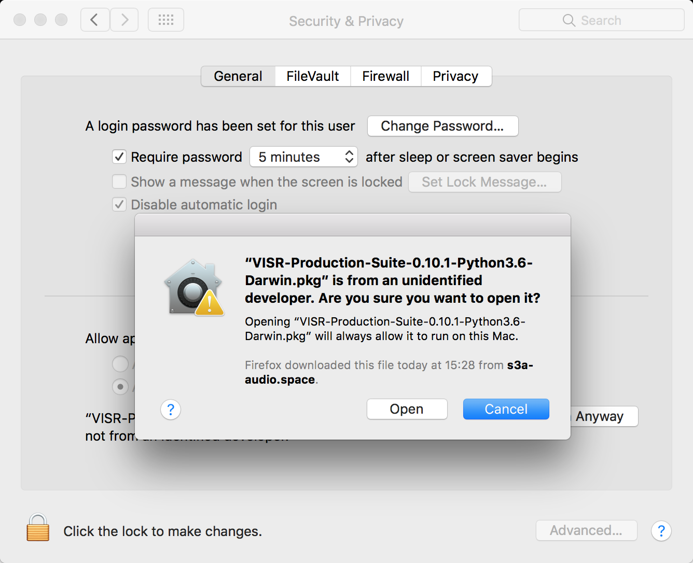
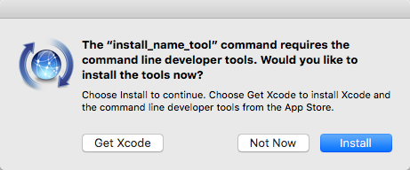
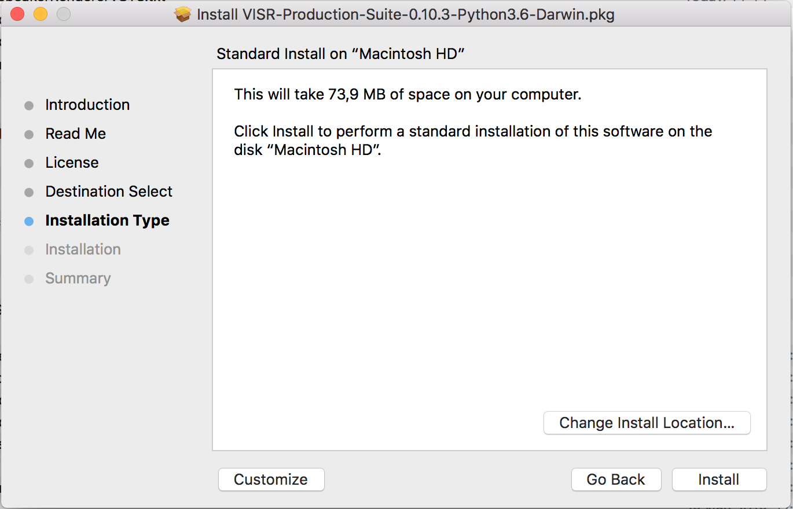
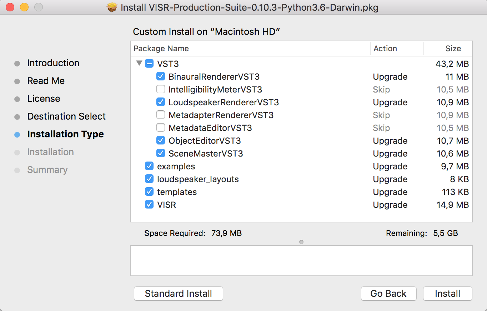

.. _installation:

Installation
____________

**Software Requirements:**

* | only for **Binaural Renderer** plugin, i.e. if you executed one of the **full (Python x.x)** installers: **Python3 (64 bit)**.
  | We recommend `Anaconda3 Python distribution <https://www.anaconda.com/download/>`_ .

.. _installation_windows:

Windows
^^^^^^^^
| The guided installer is provided as an :code:`.exe` file, and is for 64-bit versions of Windows only.
| The figure shows the component selection dialog of the installer.

.. The choices are detailed below in section :ref:`installation_component_description`.

.. _figure_windows_installer:

   Graphical Windows installer.

| If required, install the "Microsoft Visual C++ Redistributable for Visual Studio 2017", package, for example from the `Visual C++ downloads page <https://support.microsoft.com/en-us/help/2977003/the-latest-supported-visual-c-downloads>`_.

| On Windows, it is necessary to add the directory containing the VISR libraries (DLLs) and the third-party libraries shipped with the VISR installer to the :code:`PATH` variable.

.. warning:: If you have a previous installation of VISR, you may already have some ``<VISR-directory>\3rd`` and ``<VISR-directory>\lib`` folders in PATH, this could cause a problem if used in conjunction with the ``<install-directory>\3rd`` in case there is some library mismatch.

| To this end, open the environment variable editor (Settings -> System -> Advanced system settings -> Environment variables).

.. _windows_environment_variables_editor:

   Environment variable editor on Windows 10.

| Append the value ``<install-directory>\3rd`` to the path variable, where ``install_directory`` is the directory specified during the installation. When using the default installation path, that directory is ``C:\Program Files\VISR-Production-Suite\3rd`` .
| Depending on your system permissions and whether your VISR Production Suite shall be used by all users of the computer, you can either set the :code:`PATH` user variable or the :code:`PATH` system variable.

.. note::
   Any applications using the plugins of the VISR Production Suite (e.g. a DAW) must be closed and reopened before the changed paths take effect.

.. note:: Future versions of the installer might adjust the paths automatically.
   However, as pointed out in
   `NSIS Path manipulation <http://nsis.sourceforge.net/Path_Manipulation>`_,
   this needs an extremely cautious implementation to avoid potential damage to users' systems.

If you need to use the **Binaural Renderer** plugin, i.e. if you executed one of the **full (Python x.x)** installers, you need to perform some additional python configurations, described in :ref:`python_configuration`. If you are using a **Standard** installation package, no other steps are required and you can start following the :doc:`Tutorial 1 <tutorial_1>`.

Mac OS X
^^^^^^^^^

| The guided installer is provided as a :code:`.pkg` file.
| When double clicking on the installer, it may be that you get a pop-up window by MacOS operating system, telling you that the installer is unsafe:

in that case open "System Preferences" -> "Security & Privacy" and press the button "Open anyway". Then press "Open" in the pop-up window.

If your machine does not have the **command line developer tools**, you will be prompted to download them (see following Figure). Just accept that and it should automatically install those tools as part of the installation.

To access the component selection dialog, use the button "Customize" on the "Installation Type" screen

   "Installation type" screen of Mac OS X installer. Use "Customize" to get to the component selection.

The figure shows the component selection dialog of the installer.

   Component-based installer for Mac OS X.

| Normally you do not need to change the installation components, and please do that only if you know what you are doing.
| Follow the installation procedure until you get a message of successful installation.

| If you need to use the **Binaural Renderer** plugin, i.e. if you executed one of the **full (Python x.x)** installers, you need to perform some additional python configurations, described in :ref:`python_configuration`. If you are using a **Standard** installation package, no other steps are required and you can start following the :doc:`Tutorial 1 <tutorial_1>`.

.. _python_configuration:

Python configuration
^^^^^^^^^^^^^^^^^^^^^

.. note:: Follow this section of the guide only if you need to use the Binaural Renderer plugin, i.e. if you executed one of the **full (Python x.x)** installers

Two environment variables must be set to ensure the working of the VISR Python subsystem.

PYTHONPATH
  | This variable is used to add the directory containing the VISR python modules to the system path.
  | The **Binaural Renderer** plugin uses the python package **VISR BST (Binaural Synthesis Toolkit)** which is provided as part of the installation. In order for it to work, the Python interpreter must know where this package is on the current machine.
  | To this end, the :code:`python/` subdirectory of the installation folder must be added to :code:`PYTHONPATH`.

..
  Note that other ways exist to add to the system path, for example 

  .. code-block:: Python

     import sys
     sys.path.append( '<visr_installation_dir>/python' )

  However, we recommend setting :code:`PYTHONPATH` and assume this in the examples throughout this document.

PYTHONHOME
  | This variable is needed to locate the files and libraries of the Python distribution. This is especially important if there are more than one distributions on the system, most often on Mac OS X.
  | This variable has to be set to the root directory of the Python distribution, i.e., one level of hierarchy above the :code:`bin/` folder conatining the Python interpreter.
  | Depending on the platform and the distribution, the correct value might be:
  
  Windows with Anaconda
    :code:`C:\ProgramData\Anaconda3`
  Mac OS X with Anaconda
    :code:`$HOME/anaconda3/`

  | To find that path, you can use the following command on a command line prompt:

  .. code-block:: bash

    python-config --prefix

  or

  .. code-block:: bash

    python3-config --prefix
  
  .. On Linux, setting :code:`PYTHONHOME` is not necessary in most cases, because there is only the system-provided Python installation available.

  
OPENBLAS_NUM_THREADS ( Optional )
  | It is advisable, in many cases, to set the value of this environment variable to 1. It controls how :code:`numpy` numerical algebra functions are distributed to multiple CPU cores.
  | :code:`numpy` is used by the VISR Python integration as well as in many Python-based VISR components performing mathematical or DSP operations.
  | For the matrix/vector sizes typically encountered in our code, the overhead for distributing the work over multiple cores typically exceeds the potential gains.
  | Multithreading is disabled by setting the maximum number of cores (or threads) to 1:

  .. code-block:: bash

    OPENBLAS_NUM_THREADS = 1

How to set the variables
"""""""""""""""""""""""""

Depending on the operating system, these variables can be set as follows:

..
    Linux
      Append the lines
      
      .. code-block:: bash

        export PYTHONPATH=$PYTHONPATH:/usr/share/visr/python
        export OPENBLAS_NUM_THREADS=1

      to :code:`$HOME/.profile`.

Windows
  Add the environment variables either as user or system variables, as described in :ref:`installation_windows` section.
  The correct settings are (assuming the default installation directory and the Anaconda distribution):
  
  .. code-block:: bash

    PYTHONPATH=c:\Program Files\VISR-Production-Suite\python
    PYTHONHOME=c:\ProgramData\Anaconda3
    OPENBLAS_NUM_THREADS=1
  
  Note that if there is already a :code:`PYTHONPATH` variable, the recommended value should be appended, using a semicolon as a separator.

Mac OS X
    | In order to set the environment variables system-wide, without requiring that the applications in question is started from a shell, (e.g., a command-line terminal), we recommend a custom :code:`launchd` property list file, as detailed, e.g., in this `StackExchange thread <https://apple.stackexchange.com/questions/106355/setting-the-system-wide-path-environment-variable-in-mavericks>`_. In this way you can add a **LaunchAgent** that sets this variable for you.

    | For convenience, the installers provide a pre-configured :code:`VISR-Production-Suite.plist` file in the :code:`resources` subdirectory of the installation directory (e.g., :code:`/Applications/VISR-Production-Suite/resources/VISR-Production-Suite.plist` ).
    | By convention, these files should to be stored in :code:`/Library/LaunchAgents/` but that's not mandatory and in the following commands we assume you don't do that.

    .. warning:: if you used this same mechanism in the past for registering PYTHONPATH and PYTHONHOME (e.g for installing VISR ), it might be necessary to unload ( ``launchctl stop <nameOfOldPlist>`` and then ``launchctl unload <nameOfOldPlist>`` ) and then remove the files beginning with VISR in ``/Library/LaunchAgents/`` and in ``~/Library/LaunchAgents``, if any. Then start the Terminal application (restart it if it is already open) and ensure that ``echo $PYTHONPATH`` gives you an empty result. If not, a restart of the machine and re-check is suggested.

    .. todo:: , possibly with the "reopen windows at relaunch" flag unchecked.

    To activate the settings, call:

    .. parsed-literal::

       launchctl load /Applications/VISR-Production-Suite/resources/VISR-Production-Suite.plist

    .. parsed-literal::

       launchctl start /Applications/VISR-Production-Suite/resources/VISR-Production-Suite.plist

    To take effect, all applications using these settings (e.g. DAWs) must be quit and reopened.
  
    These settings are preserved if the machine is restarted.
    To deactivate them, the property list file must be unloaded:
  
    .. parsed-literal::

       launchctl unload /Applications/VISR-Production-Suite/resources/VISR-Production-Suite.plist

    .. parsed-literal::

       launchctl stop /Applications/VISR-Production-Suite/resources/VISR-Production-Suite.plist

    If you made changes to the settings, you have to perform the :code:`unload` command followed by a :code:`load`.

    Now, to test that the path is set correctly, restart the Terminal application and check the PYTHONPATH by typing:

    .. code-block:: bash

       echo $PYTHONPATH

    The output should be  ``/Applications/VISR-Production-Suite/python`` .

Additional required modules
""""""""""""""""""""""""""""

By default anaconda3 does not come with the ``pyserial`` module installed, which is needed by the **Binaural Render** plugin. To do so open Terminal application and type:

.. code-block:: bash

   conda install pyserial

Another module that might not be present in your python distribution , is ``h5py``. To install it run the following command:

.. code-block:: bash

   conda install h5py

If your python distribution does not include ``numpy`` and ``scipy`` you have to install them as well.
To sum up, you can install all the needed packages in one line with the following command:

.. code-block:: bash

   conda install numpy scipy h5py pyserial

or, if you do not have Anaconda distribution, you can achieve the same with ``pip`` or ``pip3``:

.. code-block:: bash

   pip install numpy scipy h5py pyserial

You can now start following the :doc:`Tutorial 1 <tutorial_1>` to know how to use the plugins.

.. note:: After the installation, to see the **Binaural Renderer**, normally a re-scan of the plugins is needed on the DAW you are using.

.. Do not worry if the **Binaural Renderer** window contains "ValueError: SOFA file does not exist" error message

..
    .. _installation_component_description:
    Installation components
    ^^^^^^^^^^^^^^^^^^^^^^^^

    With the dialog-based, component-enabled installers, parts of the framework can be chosen depending on the intended use of the framework.

    Shared Libraries
      The core VISR libraries. This component is mandatory and cannot be unselected.
    Standalone applications.
      Renderers and small tools to be run as command-line applications.
    Python externals
      Python modules that give access to the functionality of the framework from Python.
      Also needed to run applications that use Python internally (e.g., the binaural synthesis toolkit or metadapter-enabled rendering).
    Python Packages
      VISR extensions implemented in Python. This group of components requires the component "Python externals".
    Development files
      Header files and CMake build support - Needed to extend the VISR with components using C++ or use the framework in external C++ applications.
    Loudspeaker configurations
      A set of standard loudspeaker configuration files and additional example files from actual locations.
    Python templates
      A set of commented template files for different types of VISR components.
    Documentation
      User and code reference documentation as PDF documents.
      The Doxygen code documentation covering the complete source code can be optionally selected. However, the latter documentation is deprecated and will be contained in the code reference documentation in the future.

