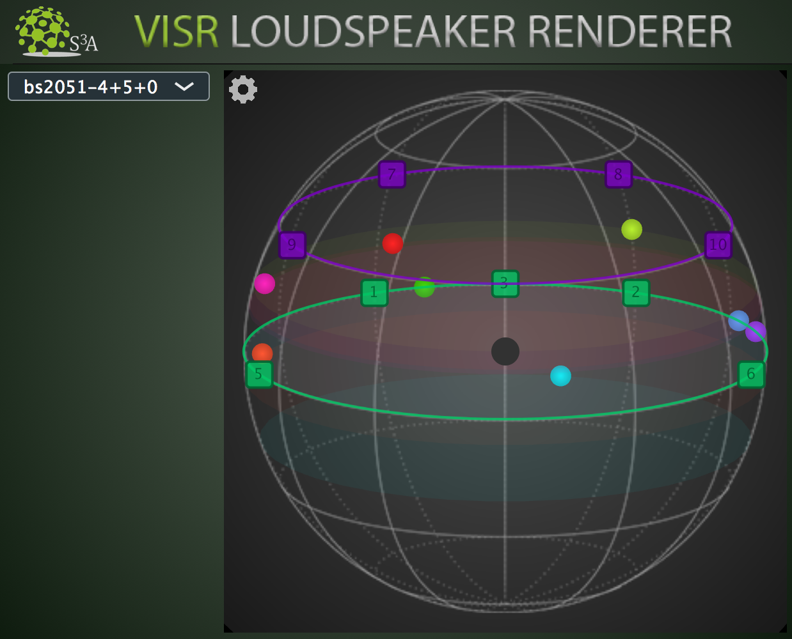

Loudspeaker Renderer
"""""""""""""""""""""

| With this plugin you can render the object-based **audio scene** using different loudspeaker layouts which you can choose from the dropdown menu, such as stereo, 5.1, 7.1 and so on.
| In this way, with just one click, you can playback the same audio production using many different audio reproduction formats and loudspeaker layouts.

**Features:**

* Render for different loudspeaker layouts using the same object-based **scene** description received by the **Scene Master** plugin
* Dynamically switch between different loudspeaker layouts
* Visualise the Loudspeakers and the objects in the same 3D sphere view
* Take advantage of state-of-the-art VBAP rendering under the hood, provided by the **VISR** framework
