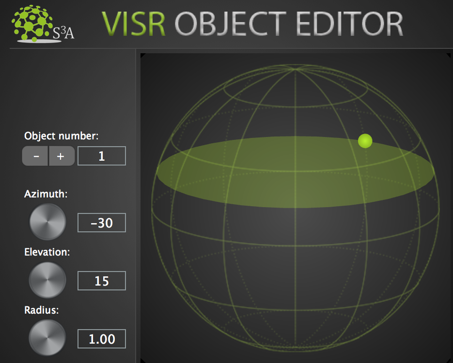

Object Editor
""""""""""""""

| The **Object Editor** is the plugin that transforms your track into an **audio object**, by generating metadata associated to the sound of the track.
| It contains 3D panning parameters as automatable metadata which are sent to the **Scene Master** while the audio signal is routed to one of the available **renderers**.
| In this way you can have complete control on the spatialisation of your tracks and you can create your object-based scene at the same time.

**Features:**

* Transform your **track** into an **audio object** generating associated metadata
* **Spatialise** your track changing the object position in virtual space
* Use the sliders or drag the object around with your mouse/trackpad
* The GUI sphere representation allows for a full-resolution 3D movement on the surface of a sphere
