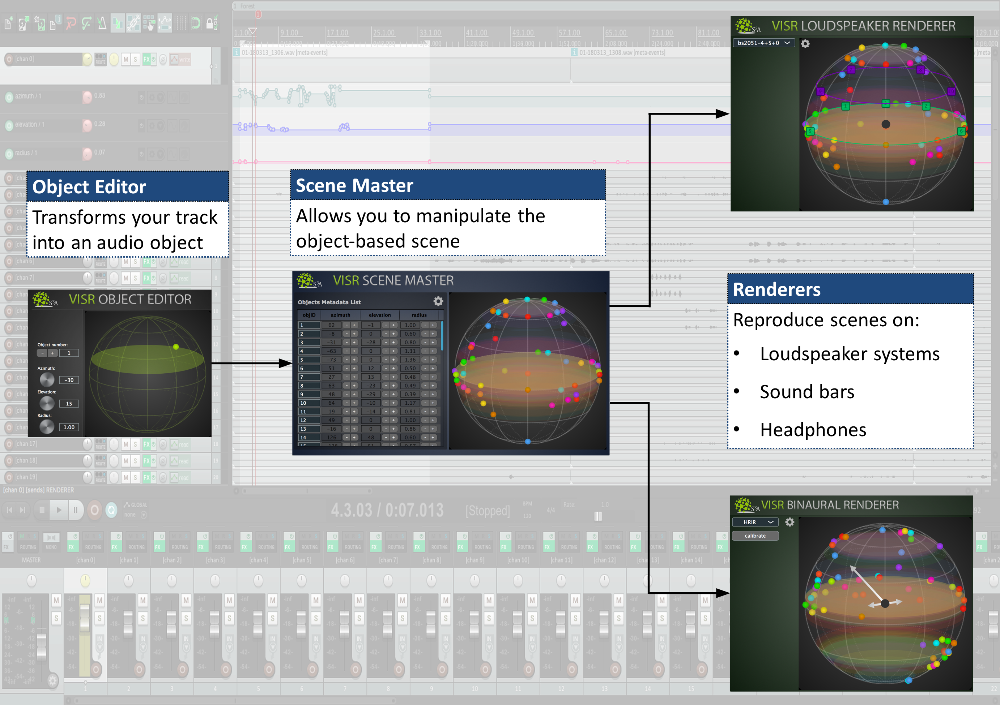
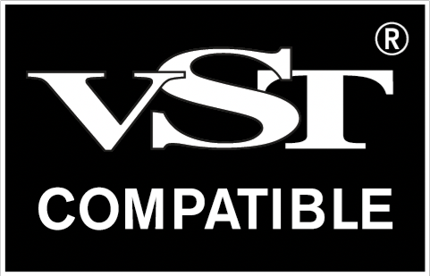

.. _production_suite:

The VISR Production Suite
---------------------------

The VISR Production Suite is the first **open-source** set of **DAW plugins** for producing and reproducing **object-based audio**.

The fundamental elements of an object-based production are:

* **Objects**: audio objects are audio **signals** with associated **metadata**. The metadata of all the objects together form the
* **Scene**: a way to represent the metadata of the set of objects, which is neutral in regard to the output audio format and system. Those information are sent to the
* **Renderer**: a component that uses the scene **metadata** to mix the **signals** of the objects in order to generate the output audio signals for different types of devices (Loudspeakers, Headphones, ...) and layouts ( stereo, binaural, 5.1, 7.1, 22.1, ...).

We provide those elements in the form of:

* an **Object Editor** plugin on each track to transform your tracks into **audio objects**
* a so called **Scene Master** plugin to manipulate the whole object-based **audio scene**
* and integrated **renderer plugins** to reproduce the scene on various loudspeaker layouts, sound bars, or headphones.

The production suite is based on the `JUCE <https://juce.com>`_ framework, which is a famous tool for easily generate DAW plug-ins in different formats, and on the `VISR <http://www.s3a-spatialaudio.org/visr>`_, a modular open-source framework for audio processing.

What you can do with the VISR Production Suite
^^^^^^^^^^^^^^^^^^^^^^^^^^^^^^^^^^^^^^^^^^^^^^^

* Create an object-based session:
* Spatialise and control your audio objects
* Easy Binaural content creation with different sets of HRIR and BRIRs in SOFA format
* Head tracking and head orientation compensation capabilities, suitable for VR
* Create loudspeaker layout agnostic spatial audio content and render it for different
  loudspeaker systems with just one click
* Exploit the features of JUCE and the VISR frameworks

The included Plugins
^^^^^^^^^^^^^^^^^^^^^

Supported Formats
""""""""""""""""""
The DAW plugins of the VISR Production suite are provided in the following formats:

* |VST| **VST®** [#f1]_ **(Virtual Studio Technology) version 3**

.. * **( Coming soon )** Standalone ( JUCE plugin wrapper )
.. * **( Coming soon )** AU (Audio Units)
.. * **( Coming soon )** AAX (Avid Audio eXtension)

Supported DAWs
"""""""""""""""
The plugins are currently fully supported by the following DAWs:

* **Reaper** ( see :doc:`tutorials <tutorial_1>` )

Although the plugins are already available in other formats (AU, AAX), it seems that at the time of writing many DAWs such as Cubase, Nuendo, Logic Pro, Ableton Live, Pro Tools are not capable of routing many objects in a single rendering plugin as separate input channels. Therefore for the time being Reaper seems the only candidate and AU and AAX are therefore not shipped with the installer.

.. _object_editor:

.. include:: object_editor.rst

.. _scene_master:

.. include:: scene_master.rst

.. _loudspeaker_renderer:

.. include:: loudspeaker_renderer.rst

.. .. include:: loudspeaker_renderer_with_metadapter.rst

.. _binaural_renderer:

.. include:: binaural_renderer.rst

.. [#f1] VST is a trademark of Steinberg Media Technologies GmbH, registered in Europe and other countries.
