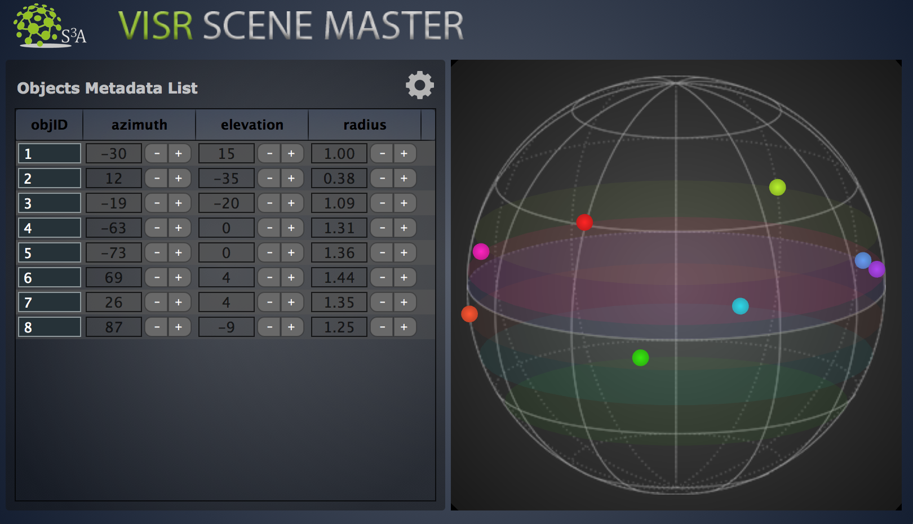

Scene Master
"""""""""""""

| The role of this plugin is to have a centralised place where you can see, control and edit the whole **object-based audio scene**.
| All the **audio objects** created with the usage of the **Object Editor** plugin are shown here in a table, and you can control them by changing the associated metadata.
| The **object-based audio scene** is format agnostic and therefore the plugin keeps all the information on the sound objects without defining a reproduction system, which can be chosen at a later stage using one of the **rendering** plugins.

**Features:**

* View the whole object-based **audio scene**
* Collect all the **audio objects** of your session in one place
* Edit and reorder all the single objects through the object table
* Control the output format agnostic **audio scene** and send it to the renderers
* Live sending of the objects using VISR object vector format
* Take scene-level decisions and perform scene-level changes from one single plugin
