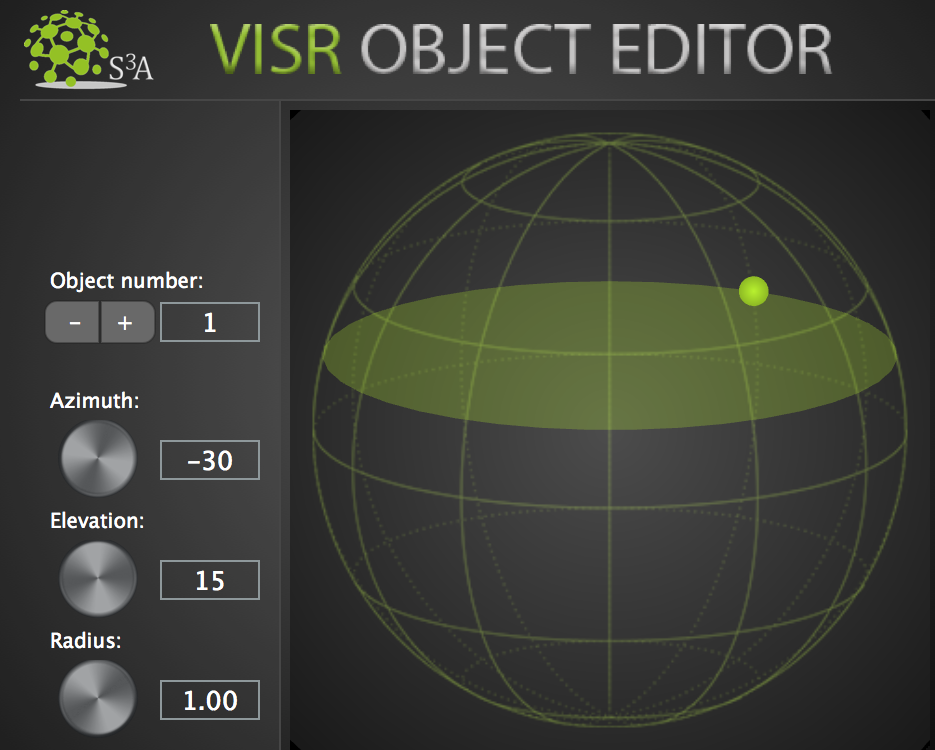

.. _tutorial_1:

Tutorial 1: Using VISR Production Suite
=======================================

.. toctree::
   :maxdepth: 2

.. note:: Reading the content of :doc:`introduction` is strongly suggested before starting this tutorial.

| First of all: what is an object-based session?
| It's a DAW session/project that contains all the fundamental elements of an object-based production, as described in the :ref:`Object-based audio <how_does_it_work>` section, are:

* **Objects**: audio objects are audio **signals** with associated **metadata**. The metadata of all the objects together form the
* **Scene**: a way to represent the metadata of the set of objects, which is neutral in regard to the output audio format and system. Those information are sent to the
* **Renderer**: a component that uses the scene **metadata** to mix the **signals** of the objects in order to generate the output audio signals for different types of devices (Loudspeakers, Headphones, ...) and layouts ( stereo, binaural, 5.1, 7.1, 22.1, ...).

All the provided plugins belong to one of the three categories above.

Within the installer, pre-populated object-based DAW sessions are currently available for :ref:`reaper_tutorial`

.. * :ref:`reaper_tutorial`
.. * **( Coming soon )** Cubase and Nuendo
.. * **( Coming soon )** Logic Pro
.. * **( Coming soon )** Ableton
.. * **( Coming soon )** Pro Tools

.. todo:: Depending on your favourite DAW, follow one of the following guides.

.. _reaper_tutorial:

REAPER
_______

Open ``<install-directory>/resources/DAW_Sessions/REAPER`` folder, where ``install_directory`` is the path specified during the installation. The default position is ``/Applications/VISR-Production-Suite`` on MacOS and  ``C:\Program Files\VISR-Production-Suite`` on Windows.

.. todo:: use |release| variable to have the current version of Visr-Production-Suite
.. todo::  .. parsed-literal:: VISR-Production-Suite-|release|/resources/DAW_Sessions/REAPER

There you will find two sub-folders: ``loudspeaker_renderer`` and ``binaural_renderer``, each one containing two Reaper project called ``example_project_VST_loudspeakers.RPP`` and ``example_project_VST_binaural.RPP``, respectively.

.. note:: if you installed the VISR Production Suite through the **standard** installer you will not have the **Binaural Renderer** plugin nor the relative REAPER session, therefore you will only see the ``loudspeaker_renderer`` folder. You can simply ignore the **Binaural Renderer** section in this documentation in that case. The following instructions are made considering the **full (Python x.x)** installations.

The only change between the two sessions is that the first renders the object-scene for a loudspeaker layout of your choice, whereas the second renders to binaural, which can be used by headphones or CTC systems.

.. note:: The two sessions are identical apart from the rendering plugins, which means that potentially, thanks to object-based audio, you could have just one object-based session and switch between different renderer plugins to reproduce the sound in different environments. However be aware that, for the time being, only one renderer instance can be present in each session at a given time, therefore if you want to change the renderer you can easily do it via removing the previous one and instantiating a new one (e.g. deleting the **Loudspeaker Renderer** and instantiating a **Binaural Renderer**).

Open one of the two Reaper projects.

In each of the two Reaper sessions you will see four tracks in total:

+--------------------------------------------+--------------------------------------------+
| example_project_VST_loudspeakers.RPP       | example_project_VST_binaural.RPP           |
+============================================+============================================+
|  * OBJECT 1                                |  * OBJECT 1                                |
+--------------------------------------------+--------------------------------------------+
|  * OBJECT 2                                |  * OBJECT 2                                |
+--------------------------------------------+--------------------------------------------+
|  * SCENE MASTER                            |  * SCENE MASTER                            |
+--------------------------------------------+--------------------------------------------+
|  * **LOUDSPEAKER RENDERER**                |  * **BINAURAL RENDERER**                   |
+--------------------------------------------+--------------------------------------------+

.. note:: On MacOS, if you run the Reaper session from the ``/Applications/(...)`` folder, it is likely that you cannot save it in that place. So please "Save as .." in another folder, or copy it beforehand in another place in the filesystem.

.. note:: Should you be asked to provide the folder containing some audio files used in the session, Click on "Search ..." and provide the ``<install-directory>/resources/DAW_Sessions/common_material`` folder.

   .. image:: ../images/file_replace_prompt.png
      :align: center
      :scale: 40 %
      :alt: alternate text

OBJECT 1, OBJECT 2 Tracks
^^^^^^^^^^^^^^^^^^^^^^^^^^
| Those are usual DAW audio tracks, containing audio items.
| As soon as they are equipped with the **Object Editor** plugin they become **audio objects** (**Objects** category) and start to be part of the object-based scene .

| Pressing the **FX** button on one of the two tracks, you can have a look at the loaded **Object Editor** plugin that we already introduced in the corresponding :ref:`Introduction <object_editor>` section.

| This plugin contains 3D panning parameters as automatable metadata.
| The right part of the GUI consists of a 3D sphere grid centred in a small grey sphere which represents the listener. The coloured small sphere is the representation of the object, and a same coloured ellipse represents the horizontal plane in which the object lays.

| If you drag the coloured sphere around you actually change the position of the object in the scene:

.. todo:: describe polar coordinates convention

* **left-click + drag around** : To move the source's **azimuth**, which is the angle on the horizontaln plane between the object and the reference front-facing point on the sphere surface, from the listener point of view.

* **right-click + drag up/down** : To move the source's **elevation**, which is the angle on the vertical plane between the object and the reference front-facing point on the sphere surface, from the listener point of view.

A value increment/decrement widget and three knobs are also provided:

* **ID**: this is the object identifier, which must be unique among the many object tracks that you may have in a session.

.. note:: Important: normally you must ensure that each instance of the plugin has a different ID number by manually adjusting the ID values. However this is already ensured in the provided session, so you don't have to do anything about that.

* **Azimuth**: changes azimuth (same as **left-click + drag around**)
* **Elevation**: changes elevation (same as **right-click + drag up/down**)
* **Radius**: is the radius of the sphere, which means the distance between the listener (you) and the virtual audio object.

  .. note:: None of the current renderers uses the radius information for rendering, which means that different values of radius make currently no audible difference. Nonetheless it is a conceptually important metadata and will be used in the future releases.

Everything that is done on a per-object-track level can be seen in real time in the following plugin, which collects all the positional information of the **Object Editor** plugins.

SCENE MASTER Track
^^^^^^^^^^^^^^^^^^^
| This track is a stub track which conceptually only serves to contain this plugin and which is not used to perform any audio input/output.
| The role of this plugin is to allow you to control and edit the whole object-based scene.

| Press the FX button on the track, you will open up the **Scene Master** plugin that we already introduced in the corresponding :ref:`Introduction <scene_master>` section.

The right part of the GUI consists of the same kind of 3D visualisation as the **Object Editor**, where here you can see all the objects present in the session under the form of differently coloured small spheres.

.. note:: unlike in the **Object Editor** plugin, here you cannot drag the objects around within the 3D sphere visualisation, but you can achieve the same effect by editing the position from within the object table on the left.

| On the left part there is a table with the complete list of all the tracks that are also **audio objects** (through the usage of the **Object Editor** plugin).
| You can control their positional metadata by changing the associated polar coordinates (azimuth, elevation, radius), and you can do that either entering the value in the corresponding text box fields or by clicking/dragging the corresponding "+" and "-" buttons.

| All these data about the objects, and therefore about the entire scene, are sent to the renderer plugin you are using ( **Loudspeaker Renderer** in the ``loudspeaker_renderer/example_project_VST_loudspeakers.RPP`` session, **Binaural Renderer** in the ``binaural_renderer/example_project_VST_binaural.RPP`` session)

LOUDSPEAKER RENDERER Track
^^^^^^^^^^^^^^^^^^^^^^^^^^^
**(only in loudspeaker_renderer/example_project_VST_loudspeakers.RPP)**

| You can consider this track as what's normally called **Master track** in DAW environments, because it is where all the channels of the tracks containing the **audio object** are routed to and where the actual rendering is performed.
| This track also receives the **object-based scene** data from the **Scene Master** plugin in order to take decisions on how to simulate the position of the **objects** with the given loudspeaker layout.

| Pressing the **FX** button on the track, you will open up the **Loudspeaker Renderer** plugin that we already introduced in the corresponding :ref:`Introduction <loudspeaker_renderer>` section.

| The right part of the GUI consists of the same 3D visualisation as the **Scene Master**, but with the addition of a representation of the chosen loudspeaker layout. Loudspeakers are displayed as green squares with numbers that indicate the channel number to which each loudspeaker is assigned to.

| The default loudspeaker layout is stereo, but you can choose a different one via the drop-down menu on the left.
| To do so, click on it, and then click on the "Select from folder ..." drop-down menu item.
| Then go to ``<install-directory>/resources/loudspeaker_layouts`` folder to try one of the provided loudspeaker configurations.

.. note:: unlike in the **Object Editor** plugin, here you cannot edit the position of the objects (e.g. dragging them on the 3D sphere visualisation) because at this point the scene is already completed and this plugin just performs the rendering of the given scene.

.. todo:: talk about the settings button.

BINAURAL RENDERER Track
^^^^^^^^^^^^^^^^^^^^^^^^
**(only in binaural_renderer/example_project_VST_binaural.RPP)**

.. note:: to see and instantiate the **Binaural Renderer**, you might need to perform a "clear cache/re-scan" of the plugins after installing. To do that press the corresponding button in REAPER "Preferences" window (``REAPER/Preferences...`` on mac, ``Options\Preferences...`` on Windows), under "VST" tab.

Like for the **Loudspeaker renderer** track (in the corresponding session), you can consider this track as what's normally called **Master track** in DAW environments, because it is where all the channels of the tracks containing the **audio object** are routed to and where the actual rendering is performed.

This track also receives the **object-based scene** data from the **Scene Master** plugin in order to take decisions on how to simulate the position of the **objects** with the given HRIR (Head Related Impulse Response), HOA (High Order Ambisonics) to binaural filter, or BRIR (Binaural Room Impulse Response).

Pressing the **FX** button on the track, you will open up the **Binaural Renderer** plugin that we already introduced in the corresponding :ref:`Introduction <binaural_renderer>` section.

When you first instantiate the plugin, the provided `Koln HRIR L2354 Dataset <http://sofacoustics.org/data/database/thk/HRIR_L2354.sofa>`_ is used as default for HRIR binaural rendering approach.
We will explain how to configure the **renderer** with some options, including the SOFA datasets to be used, in the :ref:`binaural_renderer_configuration` subsection.

On the left part of the plugin interface you can see a drop-down menu where you can choose between three different binaural rendering approaches:

* **HRIR**: This approach uses a set of Head Related Impulse Responses to dynamically select a Left and Right ear filter pair to be applied to the signals of the objects based on their position.

* **HOA**: the audio objects are encoded in High Order Ambisonics, and HOA signals are created applying the calculated spherical harmonics coefficients. Finally Ambisonics signals are convolved with special filters to get a binaural output.

* **BRIR**: similarly to the first one, this approach uses a set of Binaural Room Impulse Responses to dynamically select a Left and Right ear filter pair to be applied to the signals of the objects based on their position.

You can find more detailed information about the approaches in the VISR BST (Binaural Synthesis Toolkit) documentation. In fact the plugin is actually a wrapper around that python package, made to provide its binaural rendering in a DAW plugin.

.. _binaural_renderer_configuration:

Binaural Renderer properties configuration
"""""""""""""""""""""""""""""""""""""""""""""

| As we said, we provided a HRIR dataset to be used by default, but for using the other two approaches (HOA and BRIR) you need to provide a compatible SOFA dataset.
| Here are some datasets that you can download and use:

* HRIRs: `Koln HRIR L2354 Dataset <http://sofacoustics.org/data/database/thk/HRIR_L2354.sofa>`_ (already provided)
* BRIRs: `BBC R&D BRIRs <http://data.bbcarp.org.uk/bbcrd-brirs/sofa/>`_ (info at https://github.com/bbc/bbcrd-brirs)

If you press the gear button next to the drop-down menu you will see a set of configuration parameters that can be changed to customise your experience:

.. image:: ../images/BinauralRenderer_settings_tutorial.png
   :align: center
   :scale: 40 %
   :alt: alternate text

* **Max # objects** : is a field that lets you optimise the rendering in case you are not exceeding a certain number of audio objects. As for this session, you can set it to **3** or more.

* **Tracking** properties: you can find detailed information on how to use a tracker in :doc:`tutorial_3`. If you don't have a tracker or you don't want to use it, simply tick the "Off" checkbox.

* **SOFA file path** fields : for setting the corresponding HRIR dataset, HOA-to-binaural filters, BRIR dataset, respectively. The `SOFA <https://www.sofaconventions.org/mediawiki/index.php/SOFA_(Spatially_Oriented_Format_for_Acoustics)>`_  (Spatially Oriented Format for Acoustics) file format is a standardised (AES69-2015) file format for acoustic data.

  **Set those text fields to the path of the SOFA datasets you want to use, e.g.** `BBC R&D BRIRs <http://data.bbcarp.org.uk/bbcrd-brirs/sofa/>`_ **for the BRIR approach.**

* **Ldspk Config file path** : when using BRIR approach you should provide the loudspeaker configuration used for generating the BRIR dataset you are using. To do so you must provide that configuration through an XML configuration file. You can find the loudspeaker configuration files for the `BBC R&D BRIRs <http://data.bbcarp.org.uk/bbcrd-brirs/sofa/>`_ dataset in ``<install-directory>/resources/loudspeaker_layouts/bbcrd-brirs`` folder.

* **dynamic ITD** : whether the delay part of the HRIR/BRIR is applied separately to the (delay-free) HRIR/BRIR. That requires preprocessed HRIR/BRIR data.

* **interpolation** : Whether HRIR/BRIR grid points should be interpolated for the current head oriention. If unchecked means nearest neighbour (no interpolation) is used, when checked enables barycentric interpolation.

* **crossfade** : whether dynamic HRIR/BRIR changes are crossfaded (checked) or switched immediately (unchecked)

* **brir truncation length** : to save computational resources when using BRIRs: BRIR datasets can be very large because contain the reverberation information of a room, this field is needed for a responsive rendering.

When the tracking capabilities are not enabled (see :doc:`tutorial_3`), the right part of the GUI consists of the same 3D visualisation as the **Scene Master**.

.. note:: unlike in the **Object Editor** plugin, here you cannot edit the position of the objects (e.g. dragging them on the 3D sphere visualisation) because at this point the scene is already completed and this plugin just performs the rendering of the given scene.

Conclusion
___________

Now that you know in practice the basic features of the various plugins contained in the suite, listen to the provided session by starting the playback, and try to change and hear the position of the two **audio objects**.

If you want to try your own material in an empty session, you can also use the templates that you find in ``<install-directory>/resources/DAW_Templates``. If you want to understand how to use them or how you can create a session from scratch try the :doc:`tutorial_2`
