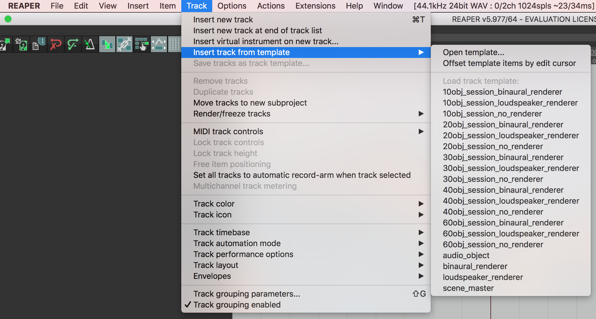
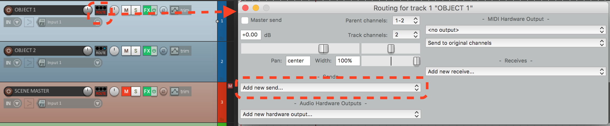
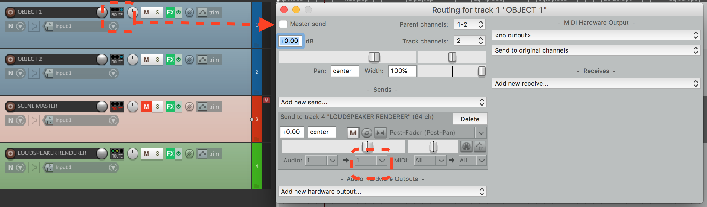
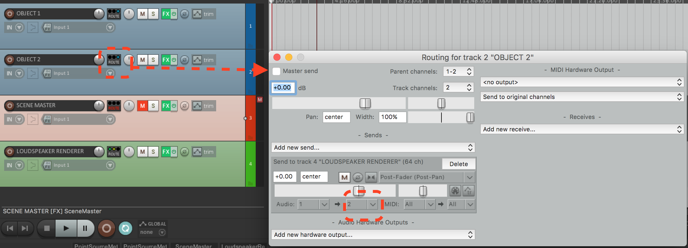

.. _tutorial_2:

Tutorial 2: Create your first object-based DAW session
=======================================================

.. toctree::
   :maxdepth: 2

| If you have followed the previous tutorial, now you are ready to create your own object-based DAW Session.

| First of all, to avoid having to create an object-based session from scratch everytime, you can use the provided templates inside ``<install-directory>/resources/DAW_Templates`` folder, where ``install_directory`` is the directory specified during the installation. The default position is ``/Applications/VISR-Production-Suite`` on MacOS and  ``C:\Program Files\VISR-Production-Suite`` on Windows.

There you will find two sub-folders: ``projecet_templates`` and ``track_templates``. In REAPER you can define project templates and track templates, the latter being sets of tracks that you can use in different projects.

In each of the two folders you will find files with the following naming patterns:

* **<x>obj_session_binaural_renderer** : this is a full object-based session with a **Binaural Renderer** and ``x`` as the number of objects (with the corresponding tracks) being used.
* **<x>obj_session_loudspeaker_renderer** : this is a full object-based session with a **Loudspeaker Renderer** and ``x`` as the number of objects (with the corresponding tracks) being used.
* **<x>obj_session_no_renderer** : this is a full object-based session with no renderer istantiated and ``x`` as the number of objects (with the corresponding tracks) being used. Note that while the renderer is not instantiated, a "RENDERER" track is present in order to have the object routing in place. In that way you can setup these project/track templates by just instantiating your preferred renderer in the "RENDERER" track.

If you want those templates to be available by default in REAPER templates, you need to copy/paste the content of ``projecet_templates`` into ``<REAPER folder>/ProjectTemplates`` and the content of ``track_templates`` into ``<REAPER folder>/TrackTemplates``.
By default ``<REAPER folder>`` is ``~/Library/Application Support/REAPER`` on MacOS, and ``C:\Users\<username>\AppData\Roaming\REAPER`` on Windows.

To use a project template, just open it as you would normally do with a REAPER session and you're ready to use that just by following :doc:`tutorial_1`.
In order to use track templates you just have to open a REAPER session and go to **Track** menu and chose the template from **Insert track from template** drop down menu.

|
|

Create a session from scratch
__________________________________________

.. note:: While you can skip this tutorial and start using the templates, it is important for you to understand the manual configurations that need to be performed, because you will likely need them in the future.

| Once again, you are about to create a DAW session/project that contains all the fundamental elements of an object-based production (see :ref:`Object-based audio <how_does_it_work>` section), which are:

* **Objects**: audio objects are audio **signals** with associated **metadata**. The metadata of all the objects together form the
* **Scene**: a way to represent the metadata of the set of objects, which is neutral in regard to the output audio format and system. Those information are sent to the
* **Renderer**: a component that uses the scene **metadata** to mix the **signals** of the objects in order to generate the output audio signals for different types of devices (Loudspeakers, Headphones, ...) and layouts ( stereo, binaural, 5.1, 7.1, 22.1, ...).

This tutorial is currently provided for :ref:`reaper_tutorial2`

.. * :ref:`reaper_tutorial2`
.. * **( Coming soon )** Cubase and Nuendo
.. * **( Coming soon )** Logic Pro
.. * **( Coming soon )** Ableton
.. * **( Coming soon )** Pro Tools

.. _reaper_tutorial2:

REAPER
^^^^^^^^^^^

| As a starting point, create a new project and create 4 audio tracks.
| On the first two tracks place one **Object Editor** plugin each, opening the **FX** window on each track and clicking the "add" button.

| As said in the previous tutorial, each **Object Editor**, and thus every track that becomes an **audio object**, has an **ID** field which is the object identifier, that must be unique.
| When you add a new **Object Editor** the default **ID** is always 1. You must ensure that each instance of the plugin has a different ID number by manually adjusting the ID values.
| In this case, having just two object tracks, it is sufficient to change the **ID** value of the **Object Editor** in the second track, from 1 to 2. Following the same logic, if you need more objects you will increase the object ID progressively in the new **Object Editor** instances.

| Once you have done that, a **Scene Master** plug-in is needed, which will collect the information regarding the two **audio objects**. To do that, add a **Scene Master** plugin through the **FX** button on the third track.
| Now you should already see that the changes performed on the **Object Editors** are mirrored in the **Scene Master**.

| Then we need a **renderer** in place to eventually use those object information for rendering.
| Therefore place one renderer of your choice (**Loudspeaker Renderer** or **Binaural Renderer**) in the remaining track.
| Remember that if you want to use more than two output channels (default for Reaper tracks) you always have to change the number of channels of the track, via the "Route" button (on the track) -> "Track channels". This is the case for the **Loudspeaker Renderer**, where you may want to support audio formats with more channels than just stereo: the suggestion is to set the number of channels to 64, which is the maximum number of channels for a track in Reaper.

.. note:: to see and instantiate the **Binaural Renderer**, you might need to perform a "clear cache/re-scan" of the plugins after installing. To do that press the corresponding button in REAPER "Preferences" window, under "VST" tab.

| Now add two mono files of your choice to the two **object tracks**.
| At this point there is one thing missing: the audio content from each **object track** needs to be routed to one of the renderer's channels.
| To do so, press the "Route" button in the first object track and go to "Add new send..." drop-down menu to select the renderer track, as shown in figure.

| Also remember to untick the "Master send" checkbox on each **object track**, since we do not want to send it to the master track, but just to one of the channels of the object-based renderer track.
| It is crucial that each **audio object** is routed to a different input channel of the track where the object-based **renderer** is:

|

Conclusion
___________

Now you should have everything in place and you can start the playback and listen to your first object-based session!

You can follow the same procedure for session with many more objects, being aware of the necessary attention that needs to be paid to the objects IDs and routing channels configurations.
