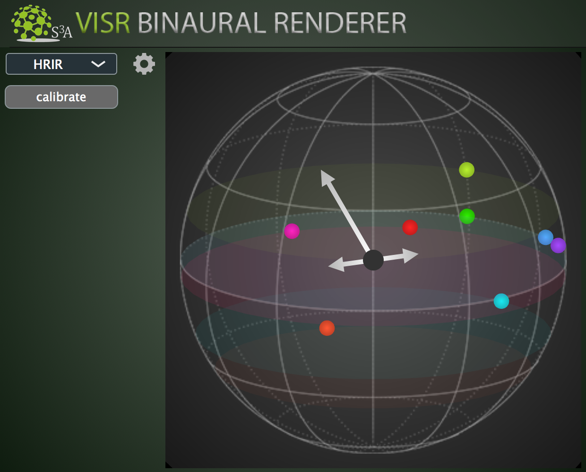
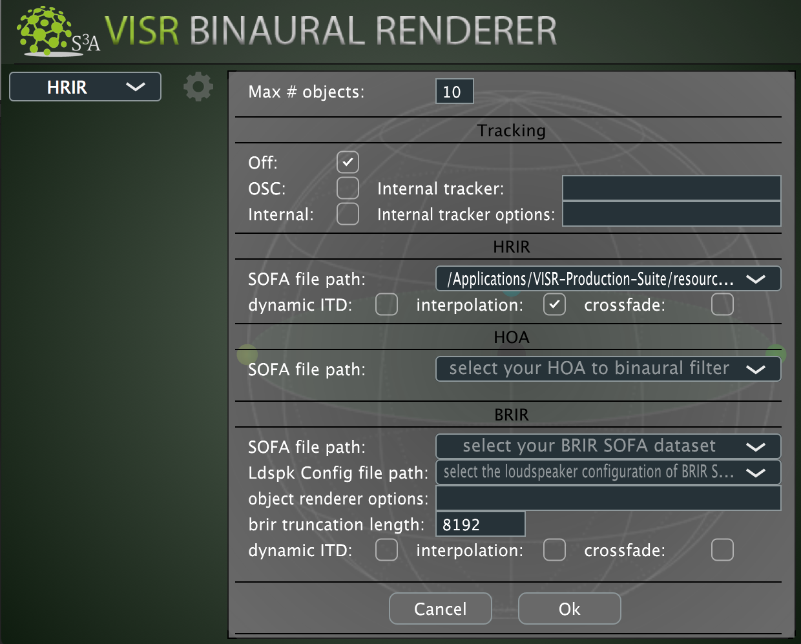

.. _tutorial_3:

Tutorial 3: Use a head position tracker with the Binaural Renderer
===================================================================

.. toctree::
   :maxdepth: 2

| This tutorial is about integrating a head tracker with the Binaural Renderer plugin, in order to perform real-time head orientation compensation and therefore to take advantage of dynamic cues in the binaural rendering.
| If you have followed the :doc:`tutorial_1`, now you are ready to go on with this tutorial.

As you can see from the figure below, in the settings panel the tracking is disabled by default ( Off ).

You can enable it by selecting one of the two mechanisms of passing the head compensation information.

OSC
____

(Coming soon)

..
    Using this approach the Binaural Renderer expects to receive data to change the virtual listener's head position and orientation through its plugin parameters.
    In order to achieve that the tracker must send these data under the form of OSC messages mapped to the corresponding Binaural Renderer automatable parameters.

    The parameters are:

    * x, y, z coordinates of head position:
    * yaw, pitch, roll angles of head inclination:

    .. warning:: If your tracker is not able to send OSC messages with the required values, a software to perform that conversion needs to be in place. Currently we don't provide this software but we aim to make it available for the most common head trackers, e.g for `HTC VIVE Tracker <https://www.vive.com/us/vive-tracker/>`_.

    The following devices are supported at the moment. Razor AHRS headtracker (https://github.com/Razor-AHRS/razor-9dof-ahrs), MrHeadTracker (https://git.iem.at/ DIY/MrHeadTracker/), HTC VIVE Tracker (https://www.vive.com/us/vive-tracker/), and Intel RealSense (https: //www.intel.com/content/www/us/en/architecture-and-technology/realsense-overview.html). The separation of the tracking data receivers and the example implementations in Python will ease the creation of components for additional tracking devices.

Internal
_________

(Coming soon)

..
    Using this approach the Binaural Renderer expects to receive data to change the virtual listener's head position and orientation through its plugin parameters.
    In order to achieve that the tracker must send these data under the form of OSC messages mapped to the corresponding Binaural Renderer automatable parameters.

    The parameters are:

    * x, y, z coordinates of head position:
    * yaw, pitch, roll angles of head inclination:

    Currently, the following devices are supported: The following devices are supported at the moment. Razor AHRS headtracker (https://github.com/Razor-AHRS/razor-9dof-ahrs), MrHeadTracker (https://git.iem.at/ DIY/MrHeadTracker/), HTC VIVE Tracker (https://www.vive.com/us/vive-tracker/), and Intel RealSense (https: //www.intel.com/content/www/us/en/architecture-and-technology/realsense-overview.html). The separation of the tracking data receivers and the example implementations in Python will ease the creation of components for additional tracking devices.

..
    Conclusion
    ^^^^^^^^^^^

    Now you should have everything in place and you can start the playback and listen to your first object-based session!
