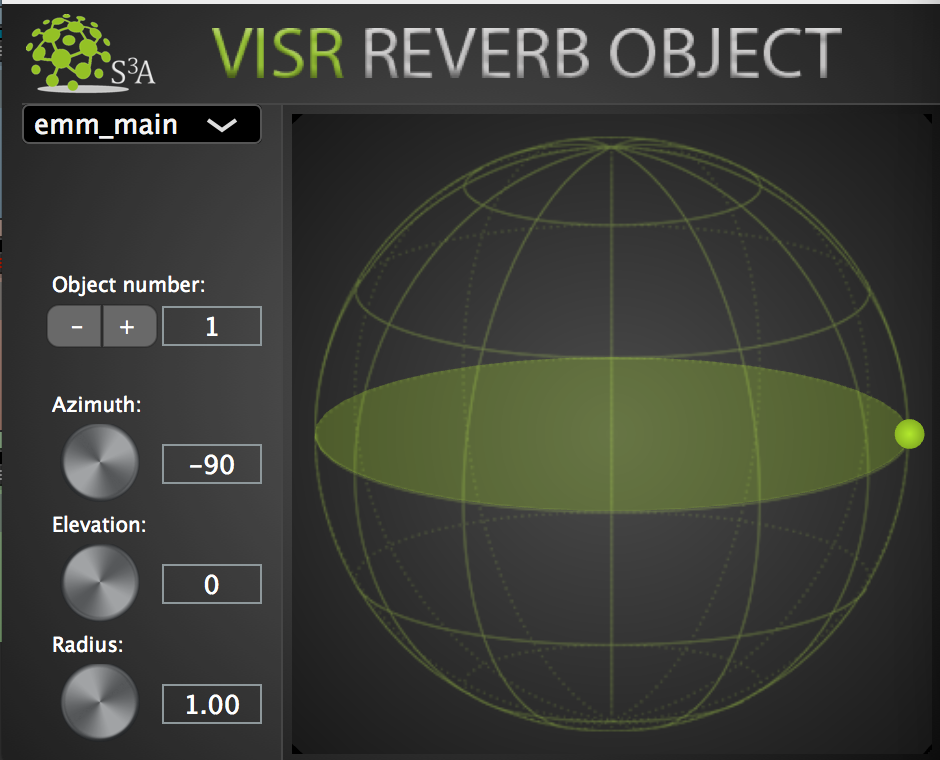
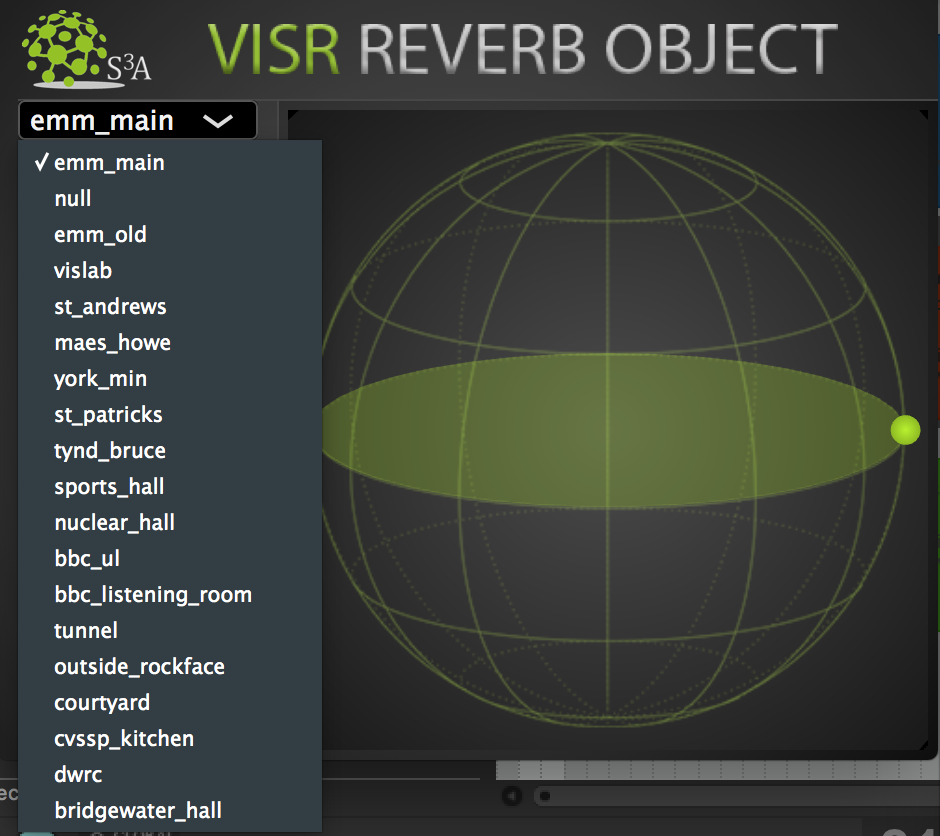
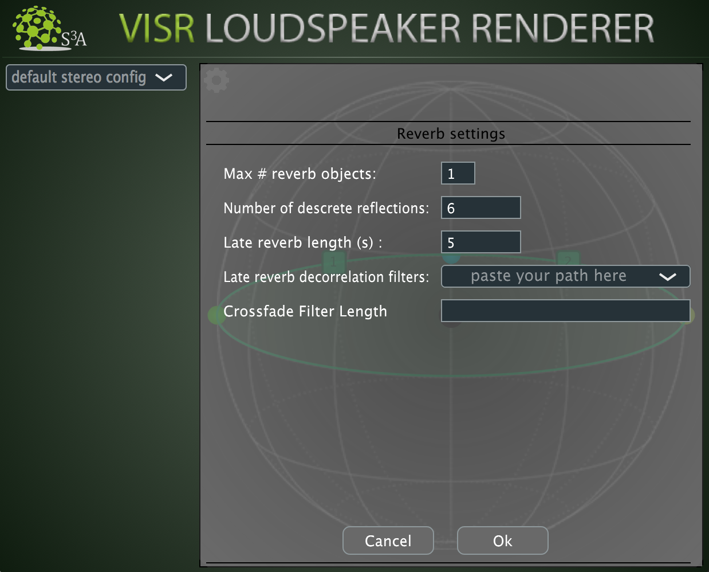
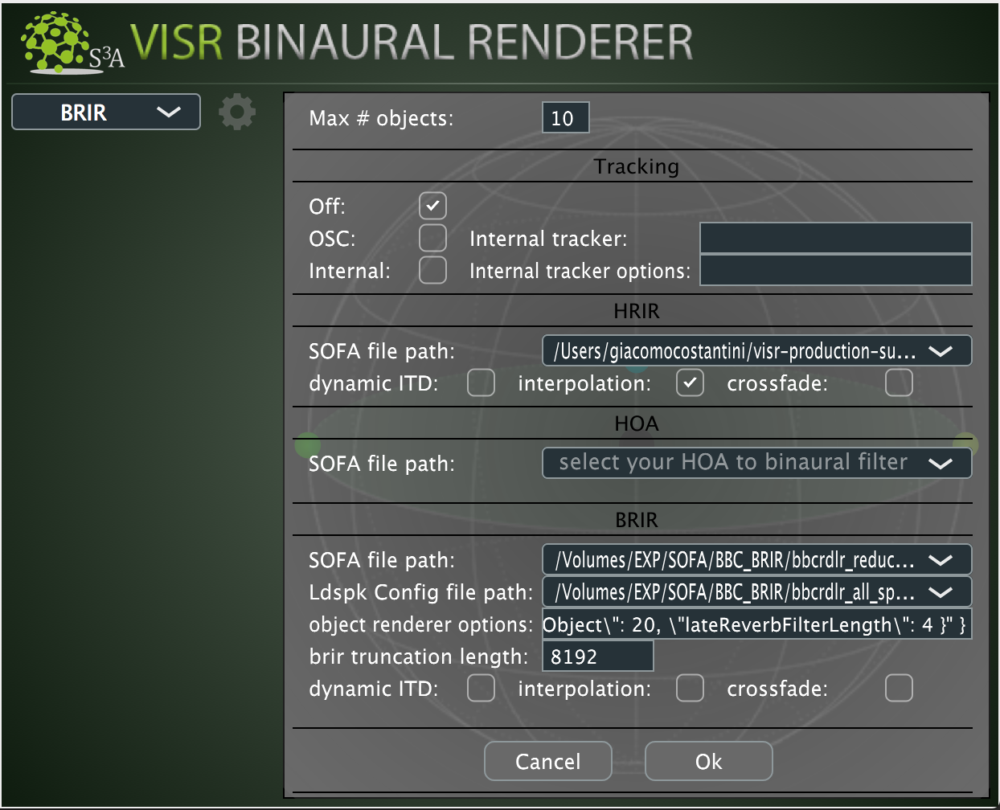

.. _tutorial_4:

Tutorial 4: Create your first Reverb-Object-Based DAW session
=============================================================

.. note:: to use the **Reverb Object** you must enable the ``ReverbObjectEditorVST3`` and the ``reverb_resources`` check boxes during the installation of the VISR Production Suite.

   .. image:: ../images/reverb_object_install.png
      :align: center
      :scale: 40 %
      :alt: alternate text

.. toctree::
   :maxdepth: 2

| If you have followed the 1st and 2nd tutorials, now you are ready to create your own object-based DAW Session with Point Source objects. In addition to creating these 'dry' objects using the Object Editor VST, you can also create reverberant objects using the Reverb Object Editor plugin. There are however, some things you should know before getting started with this.

Within the installer, a pre-populated object-based DAW session is currently available for :ref:`reaper_tutorial`

.. _reaper_tutorial:
REAPER
_______

| To get you started, open the resources file ``example_project_reverb_VST_loudspeakers.RPP`` session, provided in ``<install-directory>/resources/DAW_Sessions/REAPER/loudspeaker_renderer``.

Reverb_OBJECT 1 Track
^^^^^^^^^^^^^^^^^^^^^^^^^^
| Similarly to what you see in :doc:`tutorial_1` this is an usual DAW audio track, containing audio items.
| Pressing the **FX** button on one of the track, you can have a look at the loaded **Reverb Object Editor** plugin.
| It is conceptually the same thing as the **Object Editor** but this plugin contains also a drop-down menu containing different room environments to choose from.

Changing Rooms
"""""""""""""""""""""""""""""""""""""""""""""

Per Reverb Object Editor, there are a set of room to choose from. These are pre-recorded impulse responses, all of which have different reverberant qualities. Currently the rooms available are:

* emm_main
* null (dry point source)
* emm_old
* vislab
* st_andrews
* maes_howe
* york_min
* st_patricks
* tynd_bruce
* sports_hall
* nuclear_hall
* bbc_ul
* bbc_listening_room
* tunnel
* outside_rockface
* courtyard
* cvssp_kitchen
* dwrc
* bridgewater_hall

Whilst in playback, you can move between rooms in real-time, whether you are using the Binaural Renderer or Loudspeaker renderer.

If you cannot hear anything, make sure you check the Loudspeaker Renderer or Binaural Renderer is not throwing you any errors. If there are, make sure you have set up the Settings configuration in the Loudspeaker Renderer, or the Settings configuration and object renderer options correctly in the Binaural Renderer.

Adding New Rooms
"""""""""""""""""""""""""""""""""""""""""""""

| If you are a developer or researcher, you can use the RSAO by Luca Remaggi (On S3A Organisation's Github Repository) to calculate your own room impulse responses, and add these rooms to the ``<install-directory>/resources/RoomIRs.json`` file. Currently this is only supported via changing the RoomIRs.json file (it is not available through the UI). Be sure to make a backup of this file somewhere else before you start tampering with it.

| You can do this by taking the output room JSON file you get from RSAO, and appending it to the ``"roomlibrary"``, which is an array in JSON format. There are various online JSON editors and tree views that can both help you do this, and also validate the JSON. Failing to do so will throw unexpected errors in the Reverb Editor UI window.

| On reloading a REAPER session, you should now see this room in the dropdown menu.

OBJECT 2, OBJECT 3 Tracks
^^^^^^^^^^^^^^^^^^^^^^^^^^
See track explanation in :doc:`tutorial_1`.

SCENE MASTER Track
^^^^^^^^^^^^^^^^^^^
See same track explanation in :doc:`tutorial_1`.

LOUDSPEAKER RENDERER Track
^^^^^^^^^^^^^^^^^^^^^^^^^^^^

The **Loudspeaker Renderer** plugin uses some settings to render **Reverb Objects**, which are available via a spanner icon in the UI. Clicking on this spanner will show you some reverb configuration rendering options.

* **Max # reverb objects** : The amount of reverb objects should be equal to the amount of Reverb Object Editors you have in the session ( e.g. if you have 3 Reverb Editors on 3 REAPER tracks, you should specify 3 objects in this configuration)

* **Number of discrete reflections** : The Renderer supports a minimum of 6 reflections, and a maximum of 20 reflections, per Reverb object.

* **Late reverb length (seconds)** : The late reverb length is the length of the reverb tail. This is how long it takes for the reverb to fade out. Longer tail lengths will consume more CPU resources. I suggest between 3-6 seconds as a good starting point.

* **Late reverb decorrelation filters** : You can specify a decorrelation filter path using this field. There is a default decorrelation filter path already set in the renderer, so it is not strictly required to set a new one.

* **Crossfade Filter length** : This is how long it takes in seconds to fade between one room and another. This allows seamless transitions between rooms in real-time, as if you were walking from one room to another. The default is 2 seconds, and you can set this to higher or lower. Higher transition lengths will also consume more CPU resources.

Depending on your CPU resources, more Reverb Objects will consume more resources, and you may start to experience some audio latency and artifacts. In practice you can't currently use a lot of Reverb Objects because they are very CPU-expensive. You can try the following to reduce this consumption though:

* Reduce the number of reflections.

* Reduce the late tail (in seconds)

Optional Binaural Renderer Configuration
^^^^^^^^^^^^^^^^^^^^^^^^^^^^^^^^^^^^^^^^^^^^^^^^^^^^^^^^

There is also some support for binaural rendering too. Follow the instructions in Tutorials 1, 2 and 3 on using normal Objects and the Binaural Renderer together.

Reverb and Binaural is currently only available to use with the BRIR approach, so please follow the specified instructions in tutorial 1 on how to do that. Within the same BRIR section, there is an option file called ``object renderer options``. This configuration is specified in JSON format. Copy and paste this configuration, and adjust if necessary:

``{"reverbConfig": "{ \"numReverbObjects\": 1, \"discreteReflectionsPerObject\": 20, \"lateReverbFilterLength\": 4 }" }``

This would equal 1 reverb object with 20 reflections and a late tail length of 4 seconds. Refer to the Loudspeaker Renderer Configuration section on what these settings mean and how to modify them.
